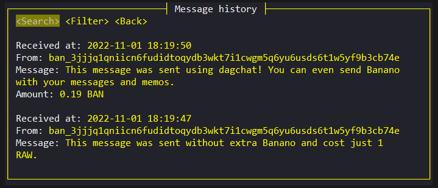

# dagchat

### An open source wallet with end-to-end encrypted, on chain messaging for **nano** and **banano**.
 

***Disclaimer:** There are no guarantees when it comes to the cryptographic security of wallets saved or messages sent with dagchat. Every care has been taken to ensure safety within the on-device wallet encryption, and the on-chain end to end encrypted messaging implementations, but this repository has not undergone a professional audit of any kind.*

# Features
- #### Import multiple wallets using a mnemonic phrase, hex seed, or even private key. Each wallet supports many accounts which can be shown procedurally or by specifying an index.
 
- #### Send on chain, end to end encrypted memos/messages using the dagchat protocol.

- #### Receive your nano and banano, and read incoming messages all in the same place.
 
- #### Messages are identified automatically by the wallet.

- #### The address book lets you easily record contacts and replaces long addresses with the short contact name wherever possible.
 
- #### Messages when sent and received are automatically encrypted and saved to your computer. They can be read again in the messages log tab.

# Building from source
To build dagchat from source, you will need to have rust and cargo installed on your machine: https://www.rust-lang.org/tools/install
1. Clone the repository or download the zip and extract it.
2. If you are building for Linux **(Windows and MacOS skip this step)** you will may need to install some other dependencies that are used for the arboard crate that manages copying and pasting in dagchat. Example command to install these libxcb packages for a debian based distro: `sudo apt-get install libxcb1-dev libxcb-render0-dev libxcb-shape0-dev libxcb-xfixes0-dev`.
3. Enter the repository's directory (either the clone, or the extracted zip) and run `cargo build --release` to build an executable in release mode. This will appear in `/target/release/`.
4. The application should be built and ready to run.
